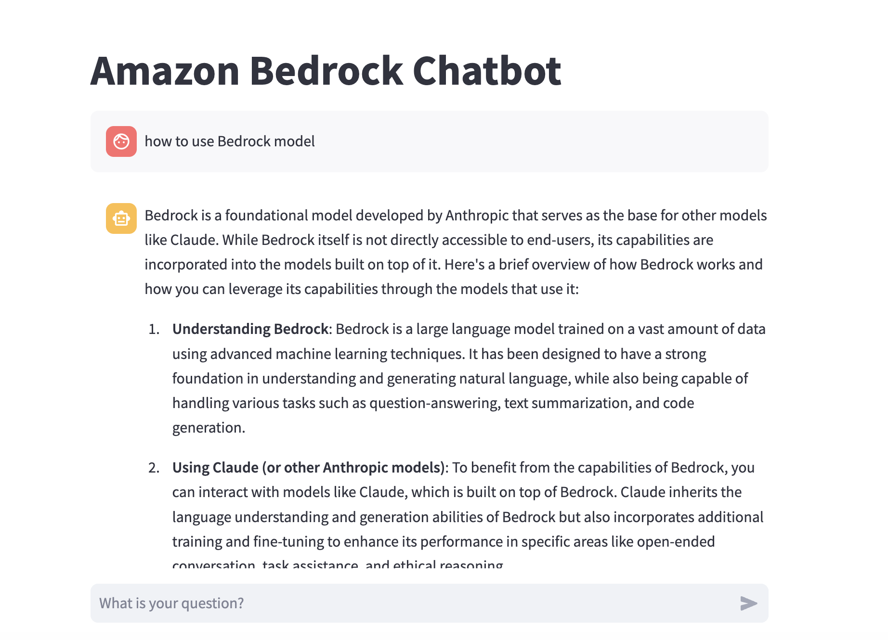

# Create a chat bot with Streamlit

## Setup environment
- Setup Bedrock environment
    - Setup AWS Credentials
    - Grant Bedrock model access as [the link](https://docs.aws.amazon.com/bedrock/latest/userguide/model-access.html)
- Install libraries
    
    ```pip install -r requirements.txt```

- Update config.yaml in needed

## Run for testing
    
```
    streamlit run bedrock_chatbot.py
```

And ready to play

